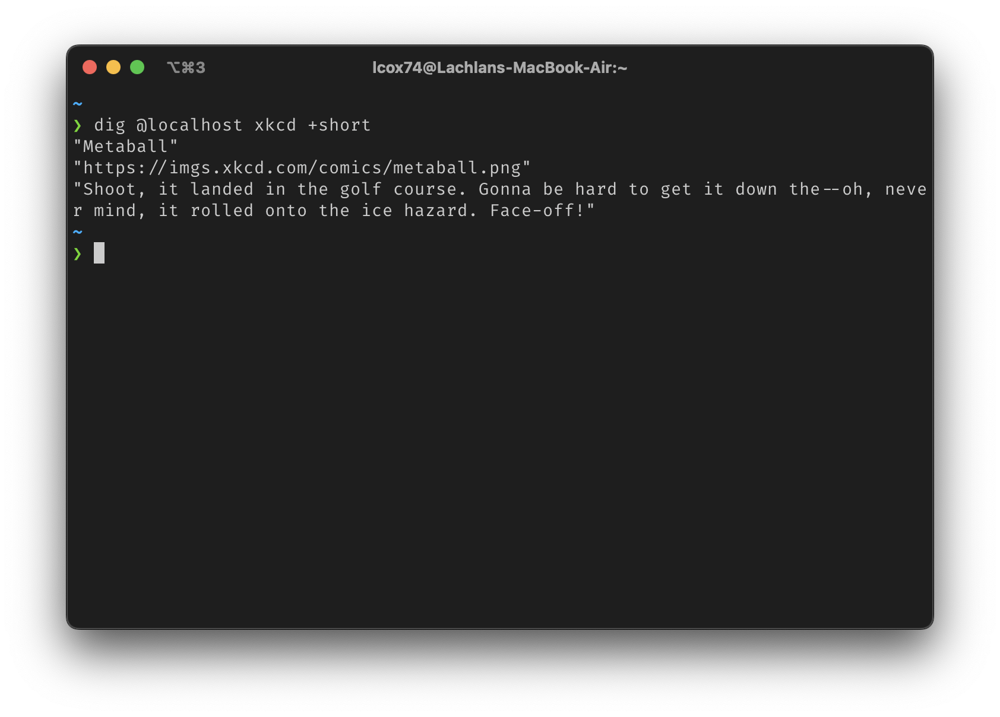

# XKCD over DNS

Are you seeking to infuse an extra dose of XKCD comics into your daily 
repertoire, but find the conventional avenues rather pedestrian? What if we were
to elegantly manipulate the DNS protocol to elegantly partake in these comics
instead? Embrace a novel approach to savoring your favorite comics, where the
ordinary gives way to the extraordinary.



## Get Started

> You will require [Go](https://go.dev/doc/install)

You can run it simply by doing the following:

```bash
go run main.go
```

Then you can query for a random comic using `dig(1)` to make the DNS requests:

```bash
dig @localhost xkcd +short
```

To fetch a specific comic you can apend the number to the domain like so:

```bash
dig @localhost 53.xkcd +short
```